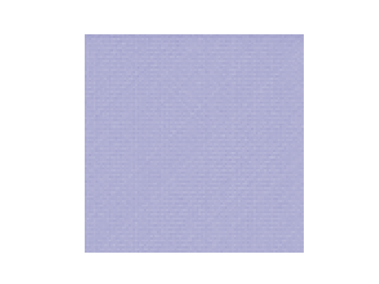
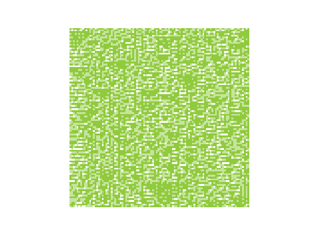

# wav-art
### Taking wav files and making generative art

## How it works
* Uses pydub to get array of data samples from an .mp3 or .wav file.
* Each data point functions as a ruleset for an Elementary Cellular Automaton.
* The Cellular Automaton is plotted with matplotlib and layered over with each data point.

## Dependencies
* Python 3.7+
  * pydub, matplotlib

## Examples
All of the images on this page are generated from a certain amount of samples from Calvin Harris' song, Slide.
